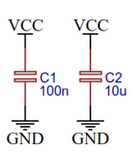
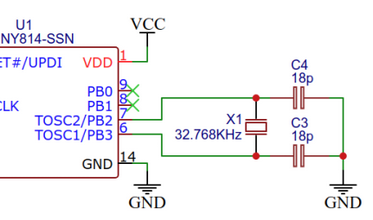

# Board
## Issues while Assembly and testing Board V1.0
- Battery Holder blocks the UPDI Connector
- The Footprint for Transistor was wrong ( GND and Trigger need to reversed)
- LEDS dont actually turn off entirely when Transistor disabled
- Oscillator zu ungenau, daher RTC drift zu hoch
- Anzeige nochmal ändern
- Debugging der MCU ist nicht gut ( wechsel auf STM32 oder RP2040)
### Adding Decoupling Capacitor 

### Add Oscillator
If there are problems with Clock accuracy, add this

### Lipo Charging 
For more Ease of use: 
Lipo Charging using TP4056 (i.e.)
https://www.meine-schaltung.de/schaltung/solar/akku_laden_mit_tp4056/

### USB Connector for Charging
Continous Power when detaching from Charging 
# Software